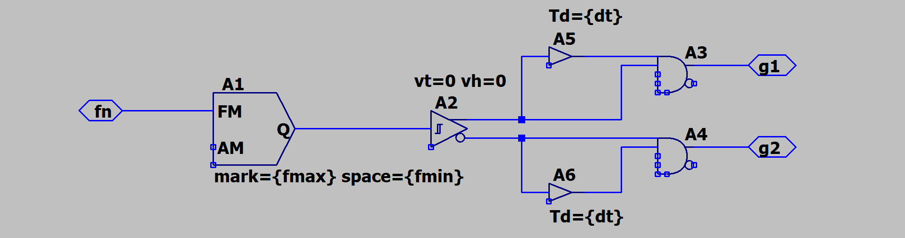
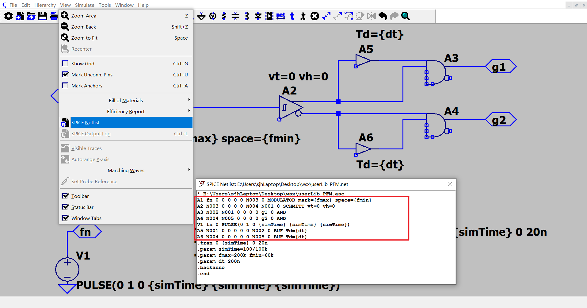
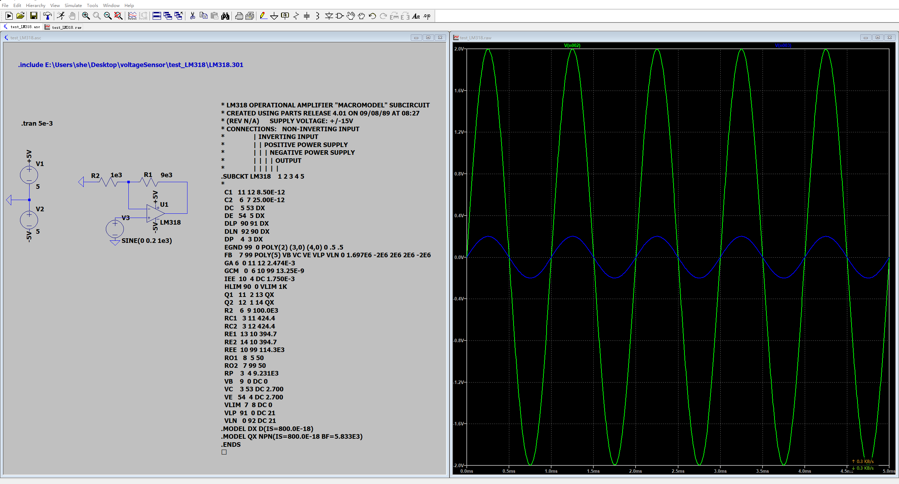
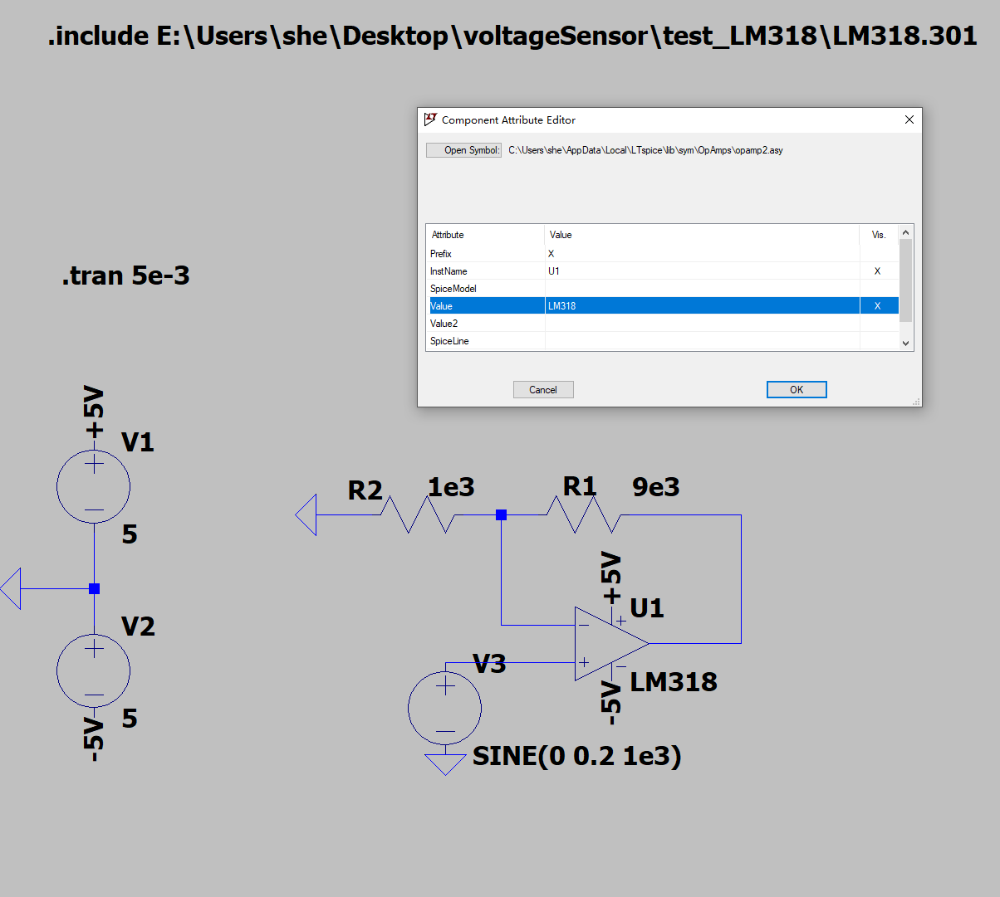
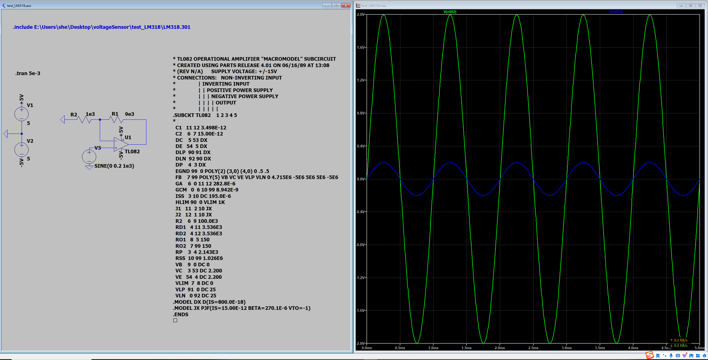

***学习笔记--LTspice***

<https://github.com/aMoonRunner/LTspice>

---

> 1.防止遗忘
> 2.绝知此事要躬行

---
- [怎样产生变频PWM？](#怎样产生变频pwm)
- [怎样制作自定义库？](#怎样制作自定义库)
- [如何用运放构建1p1z补偿器](#如何用运放构建1p1z补偿器)

### 怎样产生变频PWM？

LLC闭环控制涉及到频率可调节的PWM波如何生成的问题，下面提供了一种实现方式，详见[files/userLib_PFM](https://github.com/aMoonRunner/LTspice/tree/main/files/userLib_PFM)

### 怎样制作自定义库？

首先搭建好想要建库的电路

打开spice netlist

选择所需要的信息，如果不会操作，可以在电路图中删除，保存后再打开spice netlist

新建库文件，把spice语句复制进去，把变量默认值按如下方式写好

用ltspice自动生成symbol，就可以得到可调用的，带可编辑参数的封装库了

### 如何用运放构建1p1z补偿器
具体公式推导参考开关电源控制环路设计
