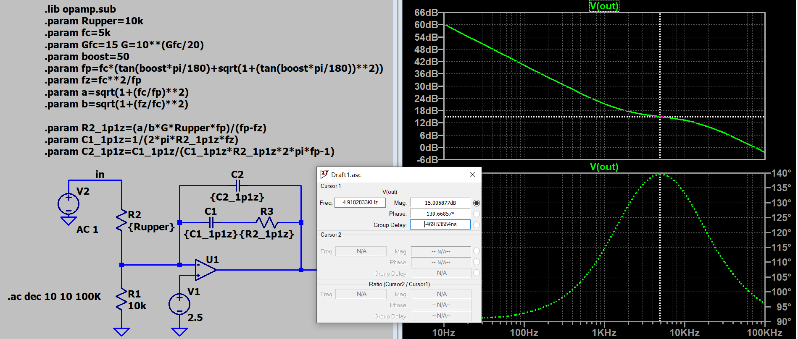
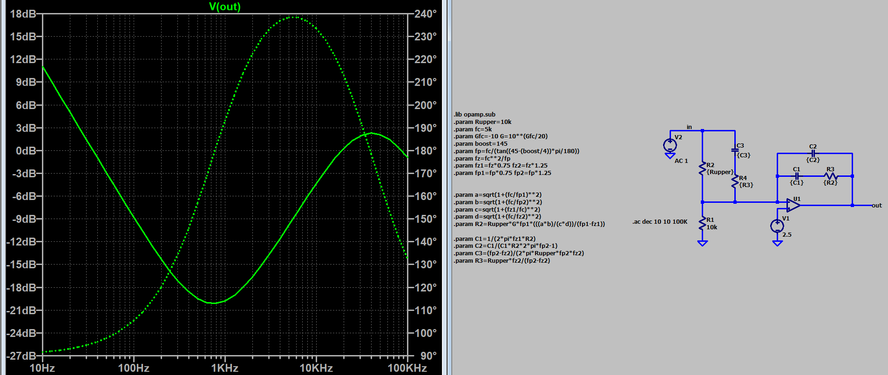
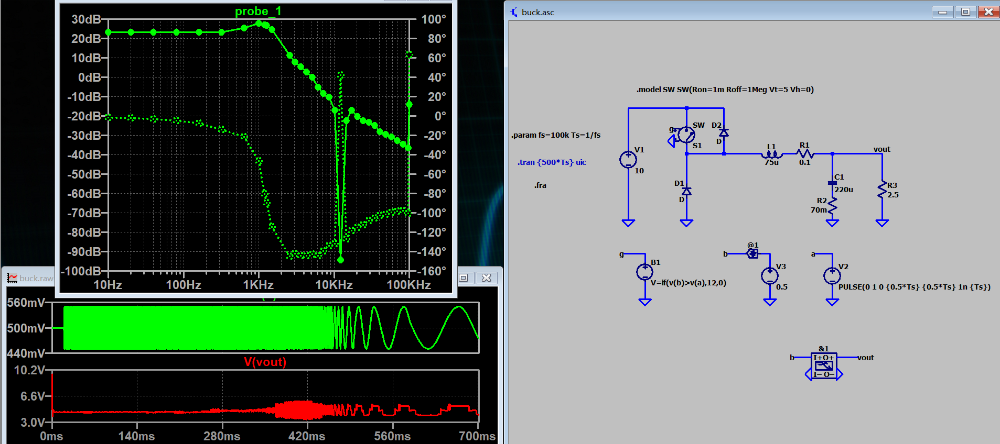

***学习笔记--LTspice***

<https://github.com/aMoonRunner/LTspice>

---

> 1.防止遗忘
> 2.绝知此事要躬行

---
- [常用仿真指令](#常用仿真指令)
- [怎样产生变频PWM](#怎样产生变频pwm)
- [怎样制作自定义库](#怎样制作自定义库)
- [如何用运放构建1p1z补偿器](#如何用运放构建1p1z补偿器)
- [如何用运放构建3p2z补偿器](#如何用运放构建3p2z补偿器)
- [怎么获取buck电路的传递函数](#怎么获取buck电路的传递函数)
- [怎么获取LLC的传递函数](#怎么获取llc的传递函数)

### 常用仿真指令

```
.options gmin=1e-10
.options abstol=1e-10
.options reltol=0.003
.options method=gear
.options cshunt=1e-12
.options gshunt=1e-9
a
.model SW SW(Ron=1m Roff=1Meg Vt=5 Vh=0)
.model userD D(Ron=1m Roff=1Meg Vfwd=0.5)
```


### 怎样产生变频PWM

LLC闭环控制涉及到频率可调节的PWM波如何生成的问题，下面提供了一种实现方式，详见[files/userLib_PFM](https://github.com/aMoonRunner/LTspice/tree/main/files/userLib_PFM)


### 怎样制作自定义库

首先搭建好想要建库的电路


打开spice netlist


选择所需要的信息，如果不会操作，可以在电路图中删除，保存后再打开spice netlist

新建库文件，把spice语句复制进去，把变量默认值按如下方式写好


用ltspice自动生成symbol，就可以得到可调用的，带可编辑参数的封装库了


也可以在新建的模型里面加上如下语句


### 如何用运放构建1p1z补偿器
具体公式推导参考开关电源控制环路设计，仿真详见[files/opa1p1z](https://github.com/aMoonRunner/LTspice/tree/main/files/opa1p1z)


### 如何用运放构建3p2z补偿器
具体公式推导参考开关电源控制环路设计，仿真详见[files/opa3p2z](https://github.com/aMoonRunner/LTspice/tree/main/files/opa3p2z)




### 怎么获取buck电路的传递函数

仿真详见[files/simplestBuck](https://github.com/aMoonRunner/LTspice/tree/main/files/simplestBuck)



fra工具是LTspice最近才推出的，在这之前也有方法能获取传递函数，详见Marcos Alonso的教程，他教程中的附件也上传到files/simplestBuck里面了


核心逻辑就是：加扰动，然后算输出跟扰动的幅值相位关系。实际上这就是功率级传递函数波特图最原始的来源，输出跟控制之间的幅频关系

有很多仿真软件都能实现这样的功能，我用过的就有plecs，simplis，simulink。就算没有，也能像Marcos Alonso一样自己搭建


### 怎么获取LLC的传递函数

与buck相比，我们还是更关心LLC的传递函数，方法与获取buck传递函数的方法类似

仿真详见[files/simplestLLC](https://github.com/aMoonRunner/LTspice/tree/main/files/simplestLLC)


