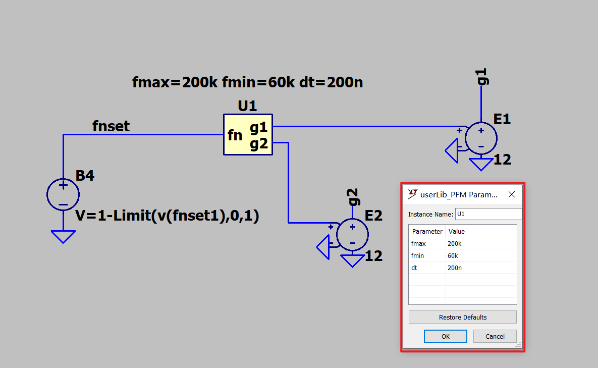
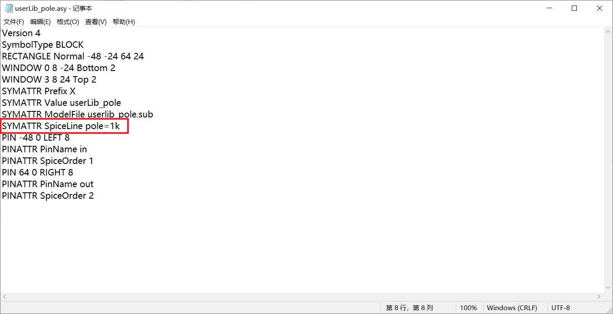

***学习笔记--LTspice***

<https://github.com/aMoonRunner/LTspice>

---

> 1.防止遗忘
> 2.绝知此事要躬行

---

- [导入第三方库](#导入第三方库)
- [加粗导线，波形](#加粗导线波形)
- [注释掉命令](#注释掉命令)
- [查看指令语法规则](#查看指令语法规则)
  - [调出常用指令](#调出常用指令)
  - [所有指令（查看 help 文档）](#所有指令查看-help-文档)
  - [自定义库](#自定义库)

# 导入第三方库

> 原则，高内聚，低耦合，建好的仿真模型发给别人，直接能用

首先复现这篇文章<https://zhuanlan.zhihu.com/p/457648572>

下载 LM318 的模型

在官网上下载 spice 模型

下载下来解压缩，文件名叫"LM318.301"，不管它

可以用这个文件在 LTspice 中自动创建图标，但是这样搞就是一个方框，不像是运放

在建好的模型中把运放换成 LM318

运行，符合预期

把 include 语句注释掉，直接把.301 文件复制进仿真，结果也符合预期

换成 TL082，仍然符合预期

# 加粗导线，波形

控制面板里有相关设置，对英语有一丢丢要求，比如 draft 是啥意思，估计调整原理图粗细的设置大概在里面

# 注释掉命令

在语句前面添加“;”或者“\*”

# 查看指令语法规则

## 调出常用指令

## 所有指令（查看 help 文档）

## 自定义库